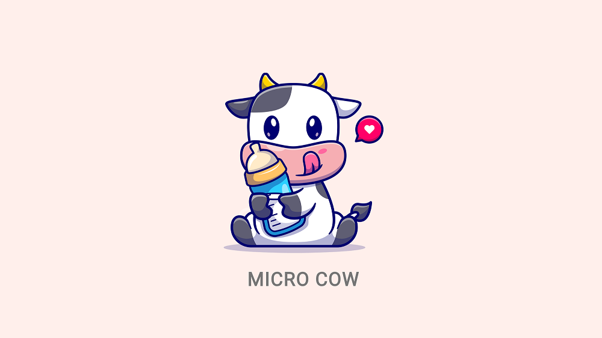

<br>
<div align="center">

<p align="center">Smart contract-based idle game built with Flutter and Linera</p>
</div>

## About Micro Cow

Micro Cow combines Rust-based smart contracts built
with [Linera](https://linera.io/), and a web app client to
access the smart contracts functionality built with one of the most popular
cross-platform
frameworks, [Flutter](https://flutter.dev).

Micro Cow smart contract will cover several capabilities of Linera that
exist in
the Devnet,
which include:

1. Authentication
2. Cross-Chain Messages
3. Custom Types
4. Contract Instantiation
5. Instantiation Argument
6. Application Parameters
7. Channel Subscription

While the Micro Cow web app will cover the following:

1. Setting Linera wallet through calls to node service
2. Calling Linera smart contract function using GraphQL

## Get Started

This article is specifically about the Flutter web app for Micro Cow.

Discussion for **Micro Cow** smart contract is in
the [Micro Cow Linera repository](https://github.com/hasToDev/micro_cow_linera).

The Micro Cow web app in this repository was developed
using `Flutter version 3.22.2` and `Dart version 3.4.3`

## Clone, Run, Build, and Deploy

1. Clone the repository:
    ```shell
    git clone https://github.com/hasToDev/micro_cow_app.git
    ```

2. If you wish to deploy your own smart contract version, make sure to change
   the `rootChainID` and `applicationID`in
   the [`micro_cow_contract.dart`](lib/contracts/micro_cow_contract.dart) file with the one
   you receive from the **Linera CLI** during deployment.


3. Install all the project dependencies:
    ```dart
    flutter pub get
    ```
4. Run on local browser (**web-port** is optional between 0-65535):
    ```dart
    flutter run --web-renderer canvaskit -d web-server --web-port 45454
    ```
5. Generate the release build for **Micro Cow** Web app:
    ```dart
    flutter clean
    flutter pub get
    flutter build web --web-renderer canvaskit --release
    ```

## How to Play

Before playing **Micro Cow**, make sure the **Linera GraphQL Service** is alive by running command `linera service` on
your
terminal.

1. on Login page, click the **Wallet Setting** to setup your Linera Wallet first.
2. on Setting page, enter the **GraphQL service address** (it is advisable to use http://127.0.0.1:8080 instead
   of http://localhost:8080), then click **check** button.
3. If your **GraphQL service address** is valid, you will see the list of **ChainID** that you can use to play **Micro
   Cow**,
   choose one of them, then click **confirm**.
4. Now you can start **Login** to play the game.
5. Web app will automatically request Micro Cow application, if it doesn't exist in your chain.
6. Web app will also initialize your account with **10000 LINERA token** if this is the first time you play the game.
7. This whole initial process could take up to 40 seconds, give or take.
8. You can Buy your cow at the market using **LINERA token** in your balance.
9. When buying the cow, choose your Cow name wisely because the name is unique
   in **Micro Cow** . The cow gender will be assigned randomly by the smart
   contract.
10. Feed cow every 6 hours intervals. If you don't feed the cow within 24 hours, the cow will die.
11. After your cow reaches 3 days of age, you can start selling it back to the market.
12. Of course, you can choose to keep feeding the cow. As the cow grows, the price increases (or decreases).
13. The feeding interval plays an essential role in increasing or decreasing your
    cow's value. As a rule, always feed your cow no more than 18 hours after its
    last meal.

## Cow Feeding Guides

The cow's hunger level will increase every 6 hours. Here are the levels of cow
hunger in **Micro Cow**  every 6 hours since its last feed:

1. **Full**, hour *0 - 6*
   <br>At this level, you don't need to feed the cow.<br><br>
2. **Hungry**, hour *6 - 12*
   <br>The cow feels a little hungry, and this is the optimal time to feed the
   cow.<br> Feeding at this level will
   increase cow's price by <span style="color:green">0.5%</span>.<br><br>
3. **Peckish**, hour *12 - 18*
   <br>Cow hunger grows; feed the cow right now to keep it healthy.<br>Feeding
   at this level will increase cow's price
   by <span style="color:green">0.25%</span>.<br><br>
4. **Famished**, hour *18 - 24*
   <br>Cow hungers at its peak feed the cow immediately.<br>Feeding at this
   level will decrease cow's price
   by <span style="color:red">1%</span>, but the cow will live to see another
   day.

## Cow Selling Guides

The cows that we have will be able to be sold after they are 3 days old.

If you try to sell a cow that is still underage, **Micro Cow** contract will not
execute the sale and will only provide
certain information.

Before executing the sale, **Micro Cow** contract will evaluate the cow price
and ask you to confirm the selling price.

## License

The **Micro Cow** is distributed under an MIT license. See
the [LICENSE](LICENSE) for more information.

[](https://opensource.org/licenses/MIT)

## Contact

[Hasto](https://github.com/hasToDev) - [@HasToDev](https://twitter.com/HasToDev)
